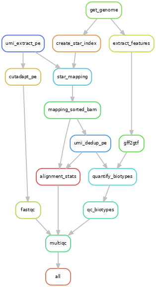

# <a id="anchortitle" />Snakemake workflow: bacterial-rnaseq-preprocessing

[](https://snakemake.github.io)
[](https://github.com/MPUSP/snakemake-bacterial-rnaseq-preprocessing/actions/workflows/main.yml)
[](https://docs.conda.io/en/latest/)
[](https://snakemake.github.io/snakemake-workflow-catalog)

------------------------------------------------------------------------

A Snakemake workflow for the preprocessing of short read rnaseq data in bacteria.

-   [Bacterial RNAseq preprocessing](#anchortitle)
    -   [Usage](#usage)
    -   [Workflow overview](#workflow-overview)
    -   [Installation](#installation)
    -   [Running the workflow](#running-the-workflow)
        -   [Input data](#input-data)
            -   [Reference genome](#reference-genome)
        -   [Execution](#execution)
    -   [Authors](#authors)
    -   [References](#references)

## Usage

The usage of this workflow is described in the [Snakemake Workflow Catalog](https://snakemake.github.io/snakemake-workflow-catalog/?usage=MPUSP%2Fsnakemake-bacterial-rnaseq-preprocessing).

If you use this workflow in a paper, don't forget to give credits to the authors by citing the URL of this (original) <repo>sitory and its DOI (see above).

## Workflow overview

This workflow is a best-practice workflow for the preprocessing of short read sequencing data in bacteria. The workflow is built using [snakemake](https://snakemake.readthedocs.io/en/stable/) and consists of the following steps:

1. Obtain genome database in `fasta` and `gff` format (`python`, [NCBI Datasets](https://www.ncbi.nlm.nih.gov/datasets/docs/v2/))
   1. Using automatic download from NCBI with a `RefSeq` ID
   2. Using user-supplied files
2. Check quality of input sequencing data (`FastQC`)
3. Cut adapters and filter by length and/or sequencing quality score (`cutadapt`)
4. Identify unique molecular identifier (UMI, `umi_tools`)
5. Map reads to the reference genome (`STAR aligner`)
6. Sort and index aligned rnaseq data (`samtools`)
7. Deduplicate reads by unique molecular identifier (UMI, `umi_tools`)
8. Quantify biotype features (`featureCounts`)
9. Generate summary report for all processing steps (`MultiQC`)

---



## Installation

**Step 1: Clone this repository**

``` bash
git clone https://github.com/MPUSP/snakemake-bacterial-rnaseq-preprocessing.git
cd snakemake-bacterial-rnaseq-preprocessing
```

**Step 2: Install dependencies**

It is recommended to install snakemake and run the workflow with `conda` or `mamba`. [Miniforge](https://conda-forge.org/download/) is the preferred conda-forge installer and includes `conda`, `mamba` and their dependencies.

**Step 3: Create snakemake environment**

This step creates a new conda environment called `snakemake-bacterial-rnaseq-preprocessing`.

``` bash
# create new environment with dependencies & activate it
mamba create -c conda-forge -c bioconda -n snakemake-bacterial-rnaseq-preprocessing snakemake pandas python=3.12
conda activate snakemake-bacterial-rnaseq-preprocessing
```

**Note:**

All other dependencies for the workflow are **automatically pulled as `conda` environments** by snakemake, when running the workflow with the `--sdm-conda` parameter (recommended).

**Step 4: Create all rule specific environments (optional)**

This step creates all conda environments specified in the snakemake rules. This step is optional.

``` bash
# activate new environment
conda activate snakemake-bacterial-rnaseq-preprocessing
snakemake -c 1 --sdm conda --conda-create-envs-only --conda-cleanup-pkgs cache
```

## Running the workflow

### Input data

#### Reference genome

An NCBI Refseq ID, e.g. `GCF_000006785.2`. Find your genome assembly and corresponding ID on [NCBI genomes](https://www.ncbi.nlm.nih.gov/data-hub/genome/). Alternatively use a custom pair of `*.fasta` file and `*.gff` file that describe the genome of choice.

Important requirements when using custom `*.fasta` and `*.gff` files:

-   `*.gff` genome annotation must have the same chromosome/region name as the `*.fasta` file (example: `NC_002737.2`)
-   `*.gff` genome annotation must have `gene` and `CDS` type annotation that is automatically parsed to extract transcripts
-   all chromosomes/regions in the `*.gff` genome annotation must be present in the `*.fasta` sequence
-   but not all sequences in the `*.fasta` file need to have annotated genes in the `*.gff` file

#### Read data

RNA sequencing data in `*.fastq.gz` format. The currently supported input data are **second generation reads**. Input data files are supplied via a mandatory table, whose location is indicated in the `config.yml` file (default: `samples.tsv`). The sample sheet has the following layout:

| sample | condition | replicate | experiment | data_folder | fq1 | fq2 | fq_umi |
|---------|---------|---------|---------|---------|---------|---------|---------|
| RNA-1 | RNA | 1 | rnaseq_mpusp_custom | data | RNA-1_R1.fastq.gz | RNA-1_R2.fastq.gz | \- |
| RNA-2 | RNA | 2 | rnaseq_mpusp_custom | data | RNA-2_R2.fastq.gz | RNA-2_R2.fastq.gz | \- |

Some configuration parameters of the pipeline may be specific for your data and library preparation protocol. The options should be adjusted in the `config.yml` file.

Currently, we support example configurations for three different sequencing protocols, *i.e.* `rnaseq_nextflex`, `rnaseq_neb_umi`and `rnseq_mpusp_custom`. These example protocols can be found in `resources/protocols/`.

### Execution

To run the workflow from command line, change the working directory.

``` bash
cd snakemake-bacterial-rnaseq-preprocessing
```

Adjust options in the default config file `config/config.yml`. Before running the entire workflow, you can perform a dry run using:

``` bash
snakemake --dry-run
```

To run the complete workflow with test files using **`conda`**, execute the following command. The definition of the number of compute cores is mandatory.

``` bash
snakemake --cores 10 --sdm conda --directory .test
```

## Author

-   Dr. Rina Ahmed-Begrich
    -   Affiliation: [Max-Planck-Unit for the Science of Pathogens](https://www.mpusp.mpg.de/) (MPUSP), Berlin, Germany
    -   ORCID profile: https://orcid.org/0000-0002-0656-1795

Visit the MPUSP github page at https://github.com/MPUSP for more info on this workflow and other projects.

## References

-   Essential tools are linked in the top section of this document